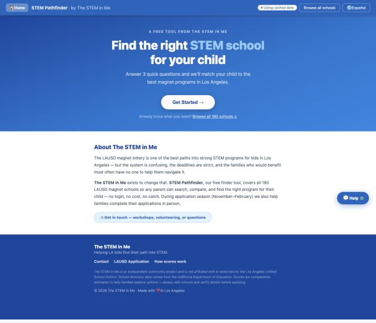
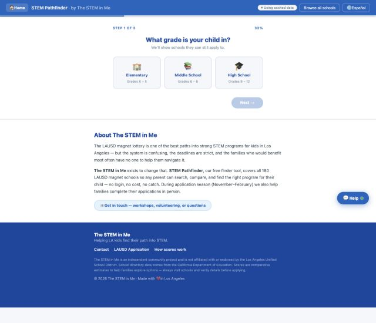
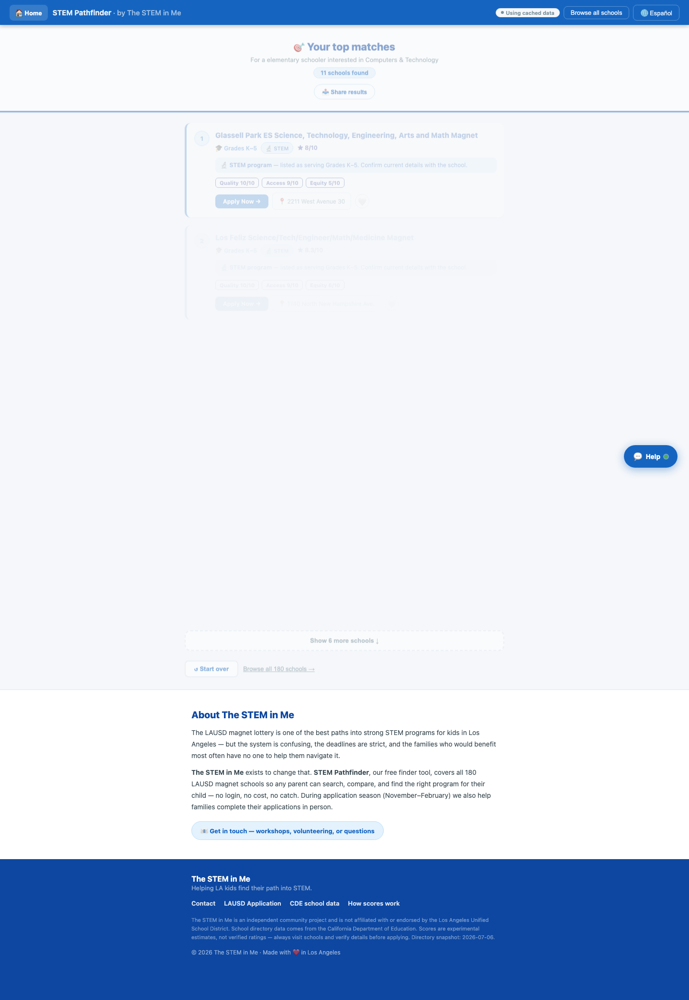

# STEM Pathfinder

A prototype that helps families in Los Angeles browse and compare magnet schools with STEM-related interests. It is part of **The STEM in Me** project.

**Demo:** https://stempathfinder.netlify.app — the home page and quiz-to-results path were opened on September 23, 2026. This check did not validate school data or score accuracy.

---

## What it does

- **3-step quiz** — grade level → interests → priority → ranked matches
- **Experimental comparison estimates** — the bundled dataset contains 180 schools with heuristic Quality, Access, and Equity values; these are not official or validated evaluations
- **Interactive map** — all 180 schools pinned on a map, color-coded by score
- **Saved schools** — save schools in the current browser's local storage
- **Share results** — quiz results encode into a URL for sharing with a partner or friend
- **Rule-based chatbot** — answers common questions and navigates parents around the site without any API calls

---

## Tech stack

| Layer | Tech |
|-------|------|
| Frontend | Vanilla HTML/CSS/JS (no framework — runs as a static file) |
| Map | [Leaflet.js](https://leafletjs.com/) + OpenStreetMap tiles |
| Scoring API | FastAPI + [Claude claude-opus-4-6](https://anthropic.com) (async, semaphore-limited) |
| Geocoding | US Census Bureau Geocoder (free, no API key) |
| Deployment | Static files; the demo URL points to Netlify |

---

## File structure

```
lausd_magnet_app/web/
  index.html       — App shell (HTML structure, meta tags, ARIA)
  styles.css       — All styles (mobile-first, CSS custom properties)
  app.js           — Main app: browse, filters, favorites, map, data loading
  quiz.js          — Quiz flow, school matching algorithm, URL sharing
  chat.js          — Rule-based chatbot (no API calls)
  schools_data.js  — 180 schools with AI scores + geocoded lat/lng

scoring_engine.py  — FastAPI scoring backend (Claude API)
convert_magnets.py — TSV → JSON converter
geocode_schools.py — Geocodes school addresses (Census Bureau API)
```

---

## How to run locally

```bash
# Serve the frontend
cd lausd_magnet_app/web
python3 -m http.server 3000

# Optional: run the scoring API after installing requirements
cd ../..
python3 -m pip install -r requirements.txt
export ANTHROPIC_API_KEY="your-key"
python3 scoring_engine.py
```

Open http://localhost:3000

---

## How scores work

The scoring API prompts Claude claude-opus-4-6 to assign three 1–10 values from limited school fields:

- **Quality** — a model estimate of program focus, without direct evidence of instructional quality.
- **Access** — a model estimate influenced by starting grade; it does not establish admissions eligibility.
- **Equity** — a model estimate without verified enrollment or student-support data.

The **Overall** score is the average of all three.

---

## Regenerating scores

```bash
export ANTHROPIC_API_KEY="your-key"
python3 scoring_engine.py
# Then hit: POST http://localhost:8000/score/file
```

## Adding geocoding (for map)

```bash
python3 geocode_schools.py
# Updates schools_data.js with lat/lng — takes ~2 minutes
```

---

## Built for

The project explores how to make a complex school-selection process easier to browse. Families should verify school details, eligibility, application dates, and program fit with LAUSD before making decisions.

## Screenshots and product notes

The interactive experience lives in `lausd_magnet_app/web/`. These captures show the live home and first quiz step on September 23, 2026:







For code review, start with `quiz.js` for matching and share links, `app.js` for browsing and saved schools, and `scoring_engine.py` for the separate scoring API.

## Safety and configuration

See [DATA_PROVENANCE.md](DATA_PROVENANCE.md) for the school-directory source, snapshot limitations, and score interpretation. The client-side Quality, Access, and Equity values are experimental heuristics, not official or validated ratings.

Keep credentials in environment variables. Never commit `.env` files or API keys. The scoring service reads `ANTHROPIC_API_KEY` at runtime; use a local `.env` file or your deployment provider's secret store.

## Roadmap

- Add LLM orchestration around school evidence retrieval and score explanations.
- Auto-fetch and normalize source data on a scheduled job with provenance tracking.
- Move long-running scoring and geocoding work to async workers with retries and status updates.

## CI

GitHub Actions runs the Python unit suite and a Chromium browser flow covering quiz results, share URLs, saved schools, refresh persistence, and the visible data snapshot date.

## Architecture and evidence

The Python API accepts school records and calls a language model with at most five concurrent requests per batch. Responses are validated as integer scores from 1 through 10; malformed or out-of-range results return a per-school error. The client is initialized only when scoring is requested, so tests and health checks do not require API credentials.

Install dependencies with `pip install -r requirements.txt`, then run `python -m unittest discover -s tests -v`. Tests mock the provider and check successful responses, invalid JSON, out-of-range scores, batch order, per-school failures, and credential-free health checks. They do not measure model accuracy or test the browser flow.

**Limitations:** the client-side scores are experimental heuristics, not verified measures of school quality or equity. School name, address, and magnet status alone do not substantiate those conclusions. Program-focus badges are inferred from school names. The app uses scores only as sorting aids, not recommendations. The separate scoring API returns language-model outputs that have not been evaluated. See [DATA_PROVENANCE.md](DATA_PROVENANCE.md).
